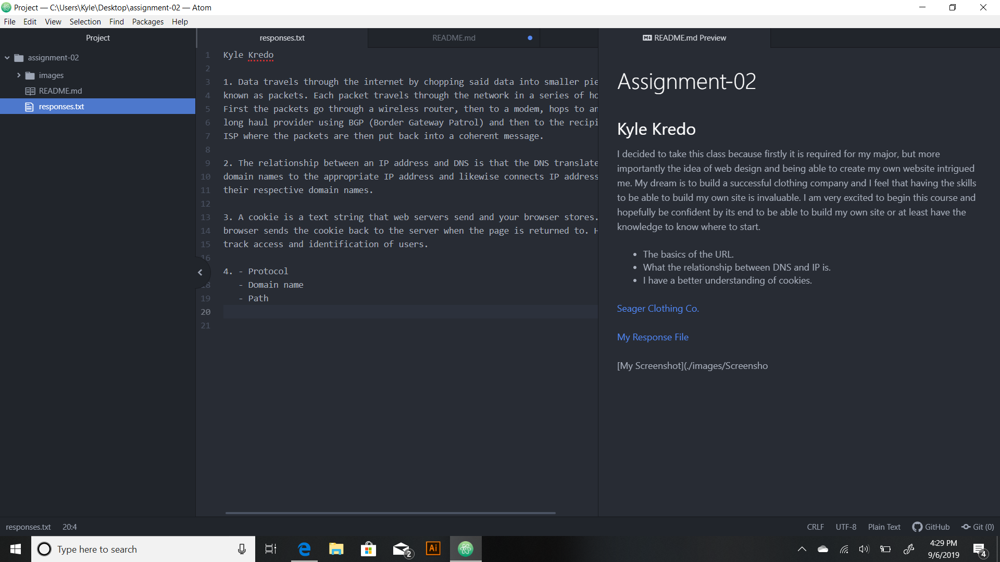

  # Assignment-02
  ## Kyle Kredo

I decided to take this class because firstly it is required for my major, but
more importantly the idea of web design and being able to create my own
website intrigued me. My dream is to build a successful clothing company and I
feel that having the skills to be able to build my own site is invaluable. I am
very excited to begin this course and hopefully be confident by its end to be
able to build my own site or at least have the knowledge to know where to start.

- The basics of the URL.
- What the relationship between DNS and IP is.
- I have a better understanding of cookies.

[Seager Clothing Co.](https://www.seagerco.com/)

[My Response File](./responses.txt)

