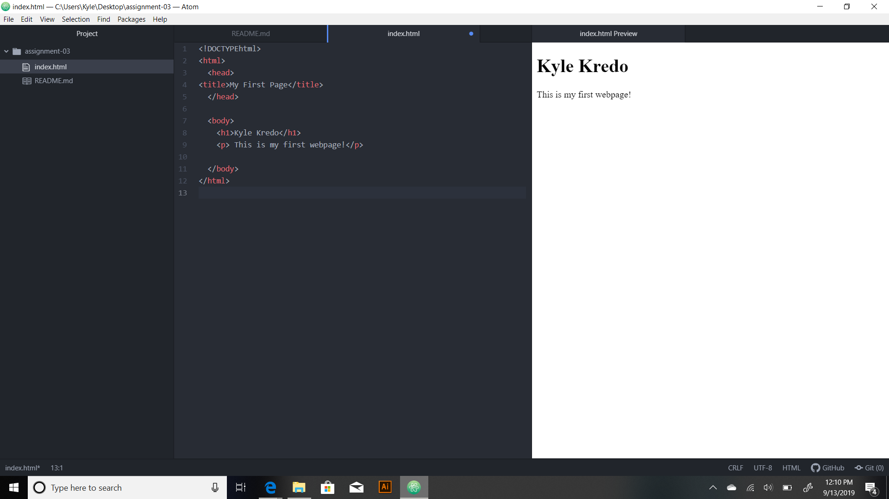

# Assignment-03
## Kyle Kredo

1. Browsers function by uses HTTP protocol and sends the request of the text document encoded by a web server and passes it on. This message contains all of the mark up code in HTML. The browser then reads this HTML and translates and displays it in a user friendly manner. Common browsers I use include:
- Chrome
-Internet Explorer
-Safari

2. Markup language, ML, is language that annotates text so the computer can manipulate text. Most of these languages are human readable and contain elements such as tags that designate the start and end of the text. A common ML is HTML, HyperText Markup Language, which defines how images, text and multimedia are displayed in web browsers. HTML uses tags to define structure.

